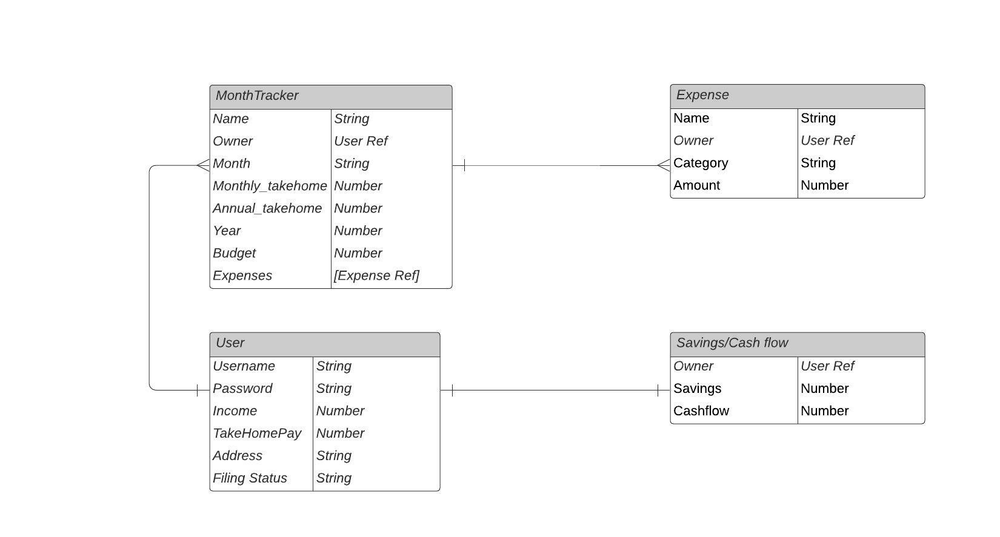

# FinP-React-Client

## FinP
FinP is a personal expense and budget tracker that is used to manage and plan one's monthly finances by calculating one's annual take-home home pay after income taxes and add expenses that will be subtracted from the monthly income. A budget planner progress bar can also be optionally set.

## User Stories
### Creating a tracker
1. A new user must create an account to use the FinP application.
2. Once logged in, the user will be presented with a dashboard that will consist a list of all individual monthly expense/budget trackers (Ex. a single tracker for March 2022, April 2022 etc.). If dashboard is empty, then user can create a new tracker.
3. When creating a new tracker, the user will name their tracker (ex. Month - Year), enter their annual salary, address, and filing status to calculate the annual and monthly take-home pay. A user can also set a monthly budget and an amount of savings to deduct from take-home pay. Once user is finished, they will then add their expenses.
4. To add an expense the user will give a name to their expense, an amount, and a category for the expense which will one of the following:
    - Housing
    - Food
    - Entertainment
    - Auto
    - Health
    - Loans
    - Shopping
    - Eating-out
    - Other
    
  Once user is done adding their expenses, they will then complete the creation of the tracker.
5. A completed tracker will display the tracker's name, monlthy take-home pay, total monthly expenses, monthly budget, a list of expenses, and an option to create a pie chart for expenses. If income exceeds expenses, a positive number in green will appear as cashflow, otherwise, a negative number will appear in red. The number 0 will appear in black if you break even.

### Managing Expenses in an Existing Tracker
1. A user can manage their expenses in a single tracker by removing or editing a single expense from their list of expenses. Each expense in the list will come with 2 buttons, an edit and remove button.
2. The edit button will display the expense form populated with the current values.
3. If values are changed and submitted, the user will be redirected back to the tracker view with the updated expenses.
4. A user can also filter the list of expenses by category using the dropdown menu.
5. A user will also have the option to remove a single expense from the tracker view.
6. A user can also add an expense from the tracker view.

### Managing Take-home Pay in an Existing Tracker
1. A user can edit their take-home pay in the tracker view by clicking the edit button which will display the income form again with the populated current values.
2. If values are changed and submitted, then user is redirected back to the tracker view with the updated take-home pay.

## ERD

## Wireframes

## Tech Stack
- MERN